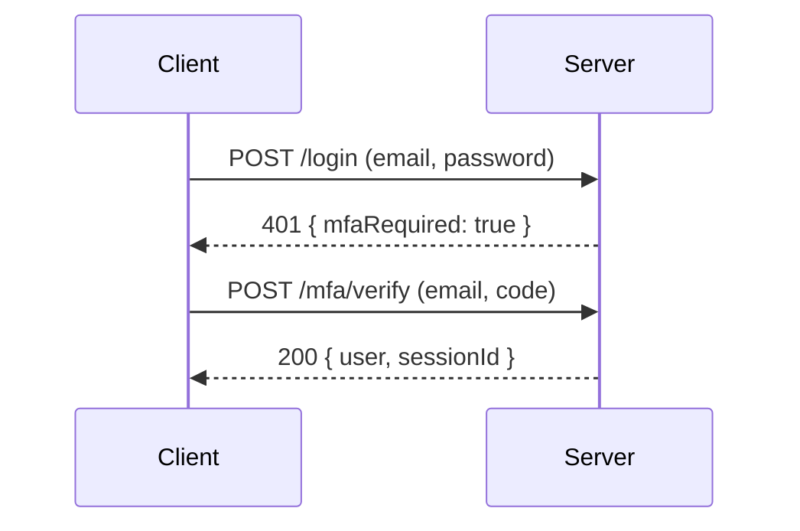

# Multi-factor auth (TOTP)

Enable TOTP-based MFA (authenticator apps) with backup codes by passing an `mfa` config to [`useAuth`](./sessions.md).

```typescript
useAuth({
  adapter,
  login,
  mfa: {
    issuer: "My App",
    requireOnLogin: true,
    getUserByEmail: async (email) => db.query.users.findFirst({ where: eq(users.email, email) }),
    getEnrollment: async (userId) => db.query.mfa.findFirst({ where: eq(mfa.userId, userId) }),
    saveEnrollment: async (userId, enrollment) =>
      db.insert(mfa).values({ userId, ...enrollment }).onConflictDoUpdate({ target: mfa.userId, set: enrollment }),
    consumeBackupCode: async (userId, index) => { /* mark backup code `index` used */ },
  },
});
```

Required callbacks: `getUserByEmail`, `getEnrollment`, `saveEnrollment`. The stored `MfaEnrollment` is `{ secret: string; enabled: boolean; backupCodeHashes?: string[] }`.

## Routes

| Route | Method | Description |
|-------|--------|-------------|
| `/mfa/enroll` | POST | Generate a TOTP secret + backup codes for the current user (saved as `enabled: false`). Returns `{ secret, otpauthUri, backupCodes }` — codes shown once. |
| `/mfa/enroll/confirm` | POST | `{ code }` — verify the first TOTP and flip the enrollment to `enabled: true`. |
| `/mfa/verify` | POST | `{ email, code }` — second-factor login step; on success creates the session. Accepts a TOTP **or** a backup code. |

## Login flow

When `requireOnLogin` is true and the user has an enabled enrollment, `POST /login` returns `{ mfaRequired: true }` with `401` if no `mfaCode` is supplied. The client then either resubmits `/login` with `mfaCode`, or calls `/mfa/verify`. A matched backup code triggers `consumeBackupCode`.



## Config

```typescript
mfa?: {
  issuer?: string;
  totp?: { step?: number; digits?: number; window?: number };
  backupCodeCount?: number;     // default 10
  requireOnLogin?: boolean;
  getUserByEmail(email): Promise<(AuthUser & { mfa?: MfaEnrollment | null }) | null>;
  getEnrollment(userId): Promise<MfaEnrollment | null>;
  saveEnrollment(userId, enrollment): void | Promise<void>;
  saveBackupCodeHashes?(userId, hashes): void | Promise<void>;
  consumeBackupCode?(userId, index): void | Promise<void>;
}
```

## Low-level primitives

For custom flows:

```typescript
import {
  generateTotpSecret, generateTotp, verifyTotp, getTotpUri, generateBackupCodes, verifyBackupCode,
} from "covara";
```

## Related

- [Sessions](./sessions.md) · [Passwords](./passwords.md) · [Account security](./account-security.md)
