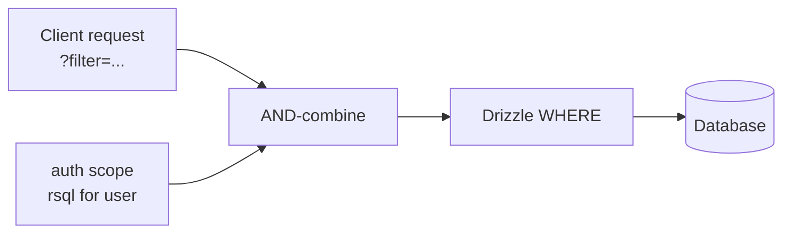

# Authorization scopes

A **scope** is an [RSQL filter](../core/filtering.md), derived from the current user, that Covara `AND`-combines with every query for a resource. Scopes are enforced on reads, writes, subscriptions, count, aggregate, and search — server-side, so a client can never widen its own access.

```typescript
import { useResource, rsql } from "covara";

useResource(postsTable, {
  id: postsTable.id,
  db,
  auth: {
    public: { read: true },                                  // anonymous read
    update: async (user) => rsql`authorId=="${user.id}"`,    // own posts only
    delete: async (user) =>
      user.metadata?.role === "admin" ? rsql`*` : rsql`authorId=="${user.id}"`,
    subscribe: async (user) => rsql`authorId=="${user.id}"`, // live stream scope
  },
});
```

| Return | Meaning |
|--------|---------|
| `rsql\`*\`` | Allow all rows for this operation. |
| `rsql\`<expr>\`` | Allow only rows matching the expression. |
| `rsql\`\`` (empty) | Deny — no rows. |

Operations: `read`, `create`, `update`, `delete`, `subscribe`. Omit one to deny it (unless `public` grants it). `public` accepts `{ read, subscribe }` flags (or `true`) for anonymous access.



## Scope patterns

Common cases are presets:

```typescript
import { scopePatterns } from "covara";

auth: scopePatterns.ownerOnly("userId"),
auth: scopePatterns.publicReadOwnerWrite("userId"),
auth: scopePatterns.ownerOrAdmin("userId", (user) => user.metadata?.role === "admin"),
auth: scopePatterns.orgBased("organizationId"),
```

## Building scopes programmatically

The `rsql` template helper interpolates values safely. Or compose with builders:

```typescript
import { rsql, eq, ne, gt, gte, lt, lte, inList, notIn, like, notLike, isNull, isNotNull, and, or } from "covara";

const a = eq("userId", user.id);
const b = and(eq("status", "active"), eq("organizationId", user.orgId));
const c = or(eq("userId", user.id), eq("public", true));
const d = like("email", "%@example.com");  // emits %=
const e = notLike("email", "%@spam.com");  // emits !%=

// equivalent template form:
const scope = rsql`userId=="${user.id}";status=="active"`;
```

:::note No NOT combinator
The filter grammar has no `NOT` combinator, so there is no `not()` helper. Use the negated operators instead: `ne` (`!=`), `notIn` (`=out=`), `notLike` (`!%=`), `isNotNull` (`=isnull=false`).
:::

## RSQL template helper

```typescript
import { rsql } from "covara";

auth: {
  update: async (user) => rsql`userId=="${user.id}"`,
  delete: async (user) => rsql`userId=="${user.id}"`,
}
```

Interpolated values are escaped, so user IDs and other dynamic values are injected safely.

## How enforcement works

Every resource endpoint routes through the [secure query builder](./secure-queries.md), which resolves the scope for the operation and combines it with the request filter before touching the database. Subscriptions resolve the `subscribe` scope at connect and match it in-memory against the changelog, so the live stream never leaks rows outside scope. See the [auth contract](../contracts/auth.md) for the guarantee.

## Related

- [Secure queries](./secure-queries.md) · [Filtering](../core/filtering.md) · [Fields & masking](../core/fields.md)
- [Subscriptions](../realtime/subscriptions.md) · [Auth contract](../contracts/auth.md)
