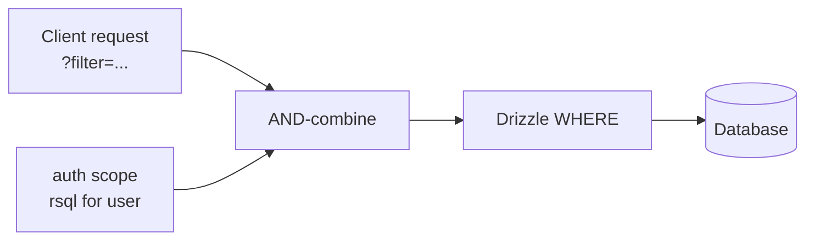

# Authorization scopes

A **scope** is an [RSQL filter](../core/filtering.md), derived from the current user, that Covara `AND`-combines with every query for a resource. Scopes are enforced on reads, writes, subscriptions, count, aggregate, and search — server-side, so a client can never widen its own access.

```typescript
import { useResource, rsql } from "covara";

useResource(postsTable, {
  id: postsTable.id,
  db,
  auth: {
    public: { read: true },                                  // anonymous read
    update: async (user) => rsql`authorId==${user.id}`,    // own posts only
    delete: async (user) =>
      user.metadata?.role === "admin" ? rsql`*` : rsql`authorId==${user.id}`,
    subscribe: async (user) => rsql`authorId==${user.id}`, // live stream scope
  },
});
```

| Return | Meaning |
|--------|---------|
| `` rsql`*` `` (or `allScope()`) | Allow all rows for this operation. |
| `` rsql`<expr>` `` | Allow only rows matching the expression. |
| ``` rsql`` ``` (empty) / `emptyScope()` | Deny — no rows. |

Operations: `read`, `create`, `update`, `delete`, `subscribe`. Omit one to deny it (unless `public` grants it).

:::info Empty scope fails closed on every operation
An empty scope is an explicit **deny** and is enforced uniformly: reads (`GET /`, `GET /:id`, `/count`, `/aggregate`, `/search`) return no rows, live `subscribe` streams match nothing, and writes return `403`. It never degrades to "no `WHERE` clause" (which would return every row), and a client-supplied `?filter=` cannot widen it — the user's filter is dropped, not applied. Returning `emptyScope()` (or an empty `` rsql`` ``) is the safe, correct way to say "this user sees nothing." Note that an *unconfigured* operation resolves to `allScope()`, not empty, so deny requires an explicit empty scope (or omitting the operation).
:::

**Anonymous access — `public`.** `public: true` makes **read and subscribe** public (writes still require auth — a safe default). The object form opts each operation in explicitly and can open **writes** too: `public: { read: true, subscribe: true, create: true, update: true, delete: true }` for a fully-public resource (e.g. a prototype or a genuinely open collection). With the object form, `subscribe` is **not** implied by `read` — grant it explicitly or anonymous SSE subscriptions return `401`. An operation not granted by `public` and reached without a user returns `401`.



## Scope patterns

Common cases are presets:

```typescript
import { scopePatterns } from "covara";

auth: scopePatterns.ownerOnly("userId"),
auth: scopePatterns.publicReadOwnerWrite("userId"),
auth: scopePatterns.ownerOrAdmin("userId", (user) => user.metadata?.role === "admin"),
auth: scopePatterns.orgBased("organizationId"),
auth: scopePatterns.authenticatedFullAccess(),        // any signed-in user, full access
auth: scopePatterns.fullyPublic(),                    // every op public, incl. anonymous writes — demos only
```

> `fullyPublic()` opts **every** operation in (read, subscribe, create, update, delete) for unauthenticated callers — it's the `covara create` starter default so the app works end-to-end; lock it down before production. For public reads with authenticated writes, use `publicReadOwnerWrite`.

## Building scopes programmatically

The `rsql` template helper interpolates values safely. Or compose with builders. See [**RSQL**](../core/rsql.md#building-rsql-in-typescript) for the full builder reference (escaping rules, every helper, sub-scope composition, and the special `allScope()`/`emptyScope()`).

```typescript
import { rsql, eq, ne, gt, gte, lt, lte, inList, notIn, like, notLike, isNull, isNotNull, and, or } from "covara";

const a = eq("userId", user.id);
const b = and(eq("status", "active"), eq("organizationId", user.orgId));
const c = or(eq("userId", user.id), eq("public", true));
const d = like("email", "%@example.com");  // emits %=
const e = notLike("email", "%@spam.com");  // emits !%=

// equivalent template form:
const scope = rsql`userId==${user.id};status=="active"`;
```

:::note No NOT combinator
The filter grammar has no `NOT` combinator, so there is no `not()` helper. Use the negated operators instead: `ne` (`!=`), `notIn` (`=out=`), `notLike` (`!%=`), `isNotNull` (`=isnull=false`).
:::

## RSQL template helper

```typescript
import { rsql } from "covara";

auth: {
  update: async (user) => rsql`userId==${user.id}`,
  delete: async (user) => rsql`userId==${user.id}`,
}
```

Interpolated values are escaped, so user IDs and other dynamic values are injected safely.

## Relation-path scopes (joins)

A scope can authorize across tables by traversing a **declared relation** as a dotted path. The classic case: a `machines` row is readable only by members of its organization, where membership lives in a separate `organization_members` table.

```typescript
// machines -> organization (belongsTo); organizations -> members (hasMany)
useResource(machines, {
  id: machines.id,
  db,
  relations: {
    organization: {
      resource: "organizations", schema: organizations, type: "belongsTo",
      foreignKey: machines.organizationId, references: organizations.id,
    },
  },
  auth: {
    read: async (user) => rsql`organization.members.userId==${user.id}`,
  },
});
```

The path `organization.members.userId` converts to a correlated subquery — no membership list is materialized in the scope, so it never goes stale and has no size cap:

```sql
WHERE EXISTS (SELECT 1 FROM organizations o
  WHERE o.id = machines.organization_id
  AND EXISTS (SELECT 1 FROM organization_members m
    WHERE m.organization_id = o.id AND m.user_id = ?))
```

Each segment is resolved against the resource's [relations](../core/relations.md) — explicit ones, **and** those [auto-discovered](../core/relations.md) from foreign keys. With `autoRelations: true` and FK `references()` in your schema, no relation config is needed at all; the auto-discovered `hasMany` back-reference is named after the table, so the path reads `organization.organization_members.userId`. Declare an explicit `members` relation if you want the friendlier name.

Supported relation kinds: `belongsTo`, `hasOne`, `hasMany`, and `manyToMany` (via its through table). Paths are capped at 5 hops and may not revisit a table (no ambiguous self-joins).

:::warning Relation paths are scope-only
A relation path is only allowed in a **trusted, developer-authored scope**. A relation path in an untrusted user-supplied `?filter=` is rejected with `400` — otherwise a client could join into other tables (e.g. probe who belongs to which organization). This holds for auto-discovered relations too: a user filter can never traverse them.
:::

### Subscriptions with relation-path scopes

A join can't be evaluated against a single changelog row in memory, so a relation-path `subscribe` scope is enforced **eventually-consistently**: the periodic scope recheck (`sse.scopeRecheckMs`, default 30s) re-runs the join as SQL and emits `added`/`removed` as membership changes. Initial `existing` events and the read path are always exact and immediate; only mid-subscription membership changes wait for the next recheck. Because the recheck is the only enforcement path, a relation-path `subscribe` scope requires `sse.scopeRecheckMs > 0` — configuring `0` is rejected at subscribe time.

## How enforcement works

Every resource endpoint routes through the [secure query builder](./secure-queries.md), which resolves the scope for the operation and combines it with the request filter before touching the database. Subscriptions resolve the `subscribe` scope at connect and match it in-memory against the changelog, so the live stream never leaks rows outside scope. See the [auth contract](../contracts/auth.md) for the guarantee.

## Related

- [RSQL](../core/rsql.md) · [Secure queries](./secure-queries.md) · [Filtering](../core/filtering.md) · [Fields & masking](../core/fields.md)
- [Subscriptions](../realtime/subscriptions.md) · [Auth contract](../contracts/auth.md)
