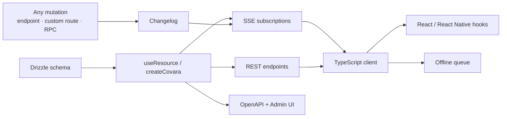

# Covara

**Your Drizzle schema is already a backend.**

Covara turns a [Drizzle ORM](https://orm.drizzle.team) schema into a complete, production-ready API — REST endpoints, real-time subscriptions, auth, file uploads, billing, email, and background jobs — with a type-safe, offline-first TypeScript client on the other end. It is built on [Hono](https://hono.dev) and runs standalone on Node or at the edge on Cloudflare Workers.

## The problem Covara solves

Every product backend is the same 80%: CRUD endpoints, filtering, pagination, auth, sessions, password reset, file uploads, webhooks for payments, transactional email, a job queue, and a client that talks to all of it. You rewrite this plumbing for every project, and the pieces never quite fit together — your realtime layer doesn't know about your auth scopes, your client types drift from your API, your offline cache fights your subscriptions.

Covara makes that 80% *one coherent system* derived from a single source of truth: your Drizzle schema.

- **Define a table** → get a full REST API with filtering, pagination, aggregations, batch ops, and OpenAPI docs.
- **Add an auth scope** → it is enforced everywhere: queries, mutations, subscriptions, search.
- **Mutate data anywhere** — a generated endpoint, a custom route, or an RPC — and every subscribed client updates in real time.
- **Use the client** → full TypeScript inference, optimistic updates, an offline queue, and automatic reconnect, in React, React Native, or plain TypeScript.

The remaining 20% — your business logic — lives in lifecycle hooks, RPC procedures, and ordinary Hono routes, with the framework's mutation tracking and typing intact.

## In one screen

```tsx
// server: a table becomes an API
import { createCovara, rsql } from "covara";
import { startServer } from "covara/node";

const app = createCovara({ cors: true }).resource("/todos", todosTable, {
  id: todosTable.id,
  db,
  auth: { update: async (user) => rsql`userId==${user.id}` },
});

await startServer(app, { port: 3000 });
```

```tsx
// client: the API becomes live UI
import { useLiveList } from "covara/client/react";

function TodoList() {
  const { items, mutate } = useLiveList<Todo>("/api/todos", { orderBy: "position" });
  return items.map((todo) => (
    <Todo key={todo.id} {...todo} onDelete={() => mutate.delete(todo.id)} />
  ));
  // creates/updates/deletes apply optimistically, sync offline,
  // and stream to every other connected client over SSE
}
```

## How the pieces fit together



A mutation through any path — a generated endpoint, a custom Hono route wrapped with [mutation tracking](./realtime/mutation-tracking.md), or an [RPC procedure](./core/procedures.md) — writes to the [changelog](./realtime/changelog.md). Subscriptions read the changelog and push deltas to connected clients with sequence numbers for reliable, resumable delivery.

## Feature map

| Area | Highlights |
|------|-----------|
| **[Core API](./core/resources-and-app.md)** | CRUD, [filtering (30+ operators)](./core/filtering.md), [cursor pagination](./core/pagination.md), [aggregations](./core/aggregations.md), [relations](./core/relations.md), [batch ops](./core/batch.md), [soft delete](./core/soft-delete.md), [computed/masked fields](./core/fields.md), [optimistic locking](./core/optimistic-locking.md), [nested writes](./core/nested-writes.md) |
| **[Real-time](./realtime/subscriptions.md)** | [SSE subscriptions](./realtime/subscriptions.md), [live aggregations](./realtime/aggregate-subscriptions.md), [changelog](./realtime/changelog.md), [mutation tracking](./realtime/mutation-tracking.md) |
| **[Auth & security](./auth/overview.md)** | [OIDC provider](./auth/oidc-provider.md), [federated login](./auth/federated.md), [JWT](./auth/jwt.md), [sessions](./auth/sessions.md), [MFA/TOTP](./auth/mfa.md), [magic links](./auth/magic-links.md), [API keys](./auth/api-keys.md), [RSQL scopes](./auth/scopes.md), [field masking](./core/fields.md), [security headers](./auth/security-headers.md) |
| **[Platform services](./platform/storage.md)** | [File storage](./platform/storage.md), [email](./platform/email.md), [billing](./platform/billing.md), [background tasks](./platform/tasks.md), [KV store](./platform/kv.md), [health checks](./platform/health.md) |
| **[Client library](./client/overview.md)** | Typed client, [React hooks](./client/react-hooks.md), [live queries](./client/live-queries.md), [offline](./client/offline.md), [auth](./client/auth.md), [file uploads](./client/files.md), [type generation](./client/typegen.md), [React Native](./client/react-native.md) |
| **[Runs everywhere](./deployment/node.md)** | [Node](./deployment/node.md), [Cloudflare Workers](./deployment/workers.md), [SQLite & PostgreSQL](./deployment/databases.md), [Durable Object KV](./deployment/durable-object-kv.md) |
| **[Tooling](./tooling/cli.md)** | [CLI scaffolder](./tooling/cli.md), [OpenAPI](./tooling/openapi.md), [Admin UI](./tooling/admin-ui.md), [middleware](./tooling/middleware.md), [error handling](./tooling/error-handling.md) |

## Requirements

- Node.js 18+ or Cloudflare Workers (`nodejs_compat`)
- TypeScript 5+
- [Drizzle ORM](https://orm.drizzle.team) (peer dependency `>=0.30.0`)
- [Hono](https://hono.dev) 4+
- [Zod](https://zod.dev) (peer dependency `>=3.0.0`)
- React `>=18` is an optional peer dependency, only needed for the React client hooks.

## Where to go next

- **[Quick Start](./quick-start.md)** — scaffold a project or add Covara to an existing app in a few minutes.
- **[Tutorial: a real-time todo app](./tutorial.md)** — build a complete app end to end, server and client.
- **[Resources & the app factory](./core/resources-and-app.md)** — the central abstraction every endpoint is built on.
- **[Contracts](./contracts/overview.md)** — the formal guarantees (and non-guarantees) the framework commits to.
