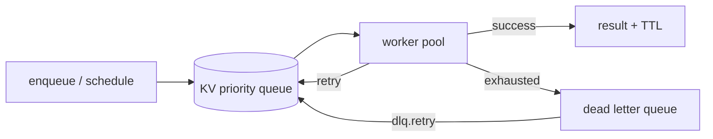

# Background tasks

Covara ships a distributed task queue backed by the [KV store](./kv.md): Zod-validated task definitions, retry strategies, delayed/cron scheduling, idempotency, concurrency caps, a dead-letter queue, and a Cloudflare Queues adapter for the edge.

## Quick start

```typescript
import {
  defineTask, initializeTasks, getTaskScheduler, getTaskRegistry, startTaskWorkers,
} from "covara/tasks";
import { createKV } from "covara/kv";
import { z } from "zod";

const kv = await createKV({ type: "redis", redis: { url: "redis://localhost" } });
initializeTasks(kv);

const sendEmailTask = defineTask({
  name: "send-email",
  input: z.object({ to: z.string().email(), subject: z.string(), body: z.string() }),
  handler: async (ctx, input) => {
    await sendEmail(input.to, input.subject, input.body);
    return { sent: true };
  },
});

getTaskRegistry().register(sendEmailTask);
await startTaskWorkers(kv, getTaskRegistry(), 3);

const taskId = await getTaskScheduler().enqueue(sendEmailTask, {
  to: "user@example.com", subject: "Welcome!", body: "Thanks for signing up.",
});
```



## Defining tasks

```typescript
const myTask = defineTask({
  name: "my-task",
  input: z.object({ data: z.string() }),
  output: z.object({ result: z.number() }),
  handler: async (ctx, input) => { /* ... */ },

  retry: {
    maxAttempts: 5,
    backoff: "exponential",   // "exponential" | "linear" | "fixed"
    initialDelayMs: 1000,
    maxDelayMs: 60000,
    retryOn: (error) => error.name !== "ValidationError",
  },

  timeout: 30000,
  maxConcurrency: 10,          // enforced fleet-wide cap
  priority: 75,                // higher = sooner (0-100)
  debounce: { windowMs: 5000, key: (input) => input.userId },
  idempotencyKey: (input) => `order-${input.orderId}`,
  idempotencyRetentionMs: 24 * 60 * 60 * 1000,
  resultTtlMs: 60 * 60 * 1000,
});
```

### Task context

| Property | Description |
|----------|-------------|
| `taskId` | Unique id |
| `attempt` | Current attempt (1-based) |
| `scheduledAt` / `startedAt` | Timestamps |
| `workerId` | Processing worker |
| `signal` | `AbortSignal` for cancellation |
| `reportProgress(percent, message?)` | Persist progress (0–100, clamped) |

```typescript
handler: async (ctx, input) => {
  for (let i = 0; i < input.rows.length; i++) {
    await importRow(input.rows[i]);
    await ctx.reportProgress((i / input.rows.length) * 100, `row ${i}`);
  }
}
// elsewhere: (await scheduler.getTask(id))?.progress → { percent, message?, updatedAt }
```

While running, the worker writes a heartbeat (`lastHeartbeatAt`, default every 10s) and extends its distributed lock; if the lock can't be extended, the task is aborted via `ctx.signal` and rescheduled.

### Idempotency & concurrency (enforced)

- **Idempotency:** when `idempotencyKey` is set, the first successful completion is recorded in KV. A second execution with the same key within `idempotencyRetentionMs` (default 24h) short-circuits and returns the stored result. Use a distributed KV so this holds across workers.
- **Concurrency:** `maxConcurrency` is enforced via a distributed counter — workers reserve a slot before running and release on completion; over-cap tasks wait for free capacity.

### Result TTL

A completed/failed task carries `resultExpiresAt = completedAt + resultTtlMs` (default 24h) and is deleted lazily on next read. Dead tasks live in the DLQ until purged.

## Scheduling

```typescript
const scheduler = getTaskScheduler();

await scheduler.enqueue(myTask, { data: "hello" });                       // ASAP
await scheduler.schedule(myTask, { data: "hello" }, { delay: 5 * 60_000 }); // delayed
await scheduler.schedule(myTask, { data: "hello" }, { at: new Date("2024-12-25T00:00:00Z") });
await scheduler.schedule(myTask, { data: "urgent" }, { delay: 1000, priority: 100 });
```

### Recurring tasks

```typescript
await scheduler.scheduleRecurring(dailyReportTask, {}, { interval: 60 * 60 * 1000 });
await scheduler.scheduleRecurring(dailyReportTask, {}, { cron: "0 0 * * *", timezone: "UTC" });
await scheduler.scheduleRecurring(weeklyDigestTask, {}, { cron: "0 9 * * 1", timezone: "America/New_York" });
```

**Missed-occurrence catchup** decides what happens when the scheduler comes back after downtime:

| `catchup` | Behavior |
|-----------|----------|
| `"skip"` (default) | Fire once for the current occurrence; drop missed ones |
| `"last"` | Run only the latest missed occurrence |
| `"all"` | One task per missed occurrence, capped at 1000 |

### Managing tasks

```typescript
const task = await scheduler.getTask(taskId);   // status: pending|scheduled|running|completed|failed|dead
await scheduler.cancel(taskId);
await scheduler.getTasks({ status: ["pending", "scheduled"], name: "send-email", limit: 100 });
await scheduler.getQueueDepth();
```

## Workers

```typescript
import { startTaskWorkers, createTaskWorker } from "covara/tasks";

const workers = await startTaskWorkers(kv, registry, 3, {
  concurrency: 5, pollIntervalMs: 1000, lockTtlMs: 30000, heartbeatMs: 10000,
});

const worker = createTaskWorker(kv, registry, { id: "worker-main", concurrency: 10, taskTypes: ["send-email"] });
await worker.start();

worker.pause(); worker.resume();
await worker.drain(30000);                       // stop claiming, wait for in-flight
await worker.stop({ drain: true, timeoutMs: 30000 });
worker.getStats();                               // { activeTasks, processedCount, failedCount, uptime, ... }
```

## Retry strategies

```typescript
retry: { backoff: "exponential", initialDelayMs: 1000, maxDelayMs: 60000 } // 1,2,4,8,16s (cap 60), +10-20% jitter
retry: { backoff: "linear", initialDelayMs: 2000, maxDelayMs: 30000 }      // 2,4,6,8s (cap 30)
retry: { backoff: "fixed", initialDelayMs: 5000 }                          // 5,5,5s
retry: { maxAttempts: 3, retryOn: (e) => e.name !== "ValidationError" }     // conditional
```

## Dead letter queue

Tasks exceeding `maxAttempts` go to the DLQ.

```typescript
import { createDeadLetterQueue } from "covara/tasks";
const dlq = createDeadLetterQueue(kv, requeue);

await dlq.list(100, 0);
await dlq.get(taskId);
const newId = await dlq.retry(taskId, "ops@example.com"); // fresh task, preserves lineage
await dlq.retryAll({ limit: 100, replayedBy: "ops@example.com" });
await dlq.purge(7 * 24 * 60 * 60 * 1000);
await dlq.count();
await dlq.audit(100); // [{ originalTaskId, newTaskId, replayedAt, replayedBy?, replayCount }]
```

**Replay lineage:** a replay creates a fresh task (new id, reset attempts) while preserving `originalTaskId` (always the first task), `replayCount`, `replayedFromDlqAt`, and `replayedBy`, and appends a durable audit entry.

**Alerting:** provide `onDlqEnqueue` (on the worker config or the DLQ) to be paged when a task is parked. Callback failures never affect persistence.

```typescript
await startTaskWorkers(kv, registry, 3, {
  onDlqEnqueue: async (entry) => alert(`Task ${entry.taskId} dead: ${entry.reason}`),
});
```

## Cloudflare Queues

On Workers there is no long-lived poller — use the Queues adapter. Retries are delegated to Cloudflare (`message.retry()`); idempotency, DLQ, and result storage still use your [KV](./kv.md).

```typescript
import { createCloudflareQueueProducer, createQueueConsumer, getTaskRegistry } from "covara/tasks";
import { createDurableObjectKV } from "covara/kv";

export default {
  async fetch(req, env) {
    const producer = createCloudflareQueueProducer(env.TASK_QUEUE);
    return new Response(await producer.enqueue(sendEmailTask, { to: "a@b.com", subject: "Hi", body: "..." }));
  },
  async queue(batch, env) {
    const consumer = createQueueConsumer({
      kv: createDurableObjectKV(env.KV_DO),
      registry: getTaskRegistry(),
      onDlqEnqueue: async (entry) => { /* alert */ },
    });
    await consumer.process(batch);
  },
};
```

```toml
[[queues.producers]]
queue = "tasks"
binding = "TASK_QUEUE"

[[queues.consumers]]
queue = "tasks"
max_batch_size = 10
max_retries = 3
dead_letter_queue = "tasks-dlq"
```

The producer maps `delay`/`at` to the queue's `delaySeconds`. DLQ entries produced by the consumer are **not** auto-requeued — replay with `dlq.retry(...)` or use a Cloudflare dead-letter queue binding. See [Workers deployment](../deployment/workers.md).

## Resource-trigger hooks

Fire tasks automatically when resources change:

```typescript
import { createTaskTriggerHooks, composeHooks } from "covara/tasks";

const taskHooks = createTaskTriggerHooks({
  onCreate: [
    { task: sendWelcomeEmailTask, when: (data) => data.role === "user" },
    { task: auditLogTask, delay: 1000 },
  ],
  onUpdate: [{ task: auditLogTask, transform: (data) => ({ changes: data }) }],
  onDelete: [{ task: auditLogTask }],
});

useResource(usersTable, { id: usersTable.id, db, hooks: composeHooks(taskHooks, { /* ... */ }) });
```

`ResourceTaskTrigger`: `{ task, when?(data), transform?(data), delay? }`.

## Recurring scheduler management

```typescript
import { createRecurringManager, startRecurringScheduler } from "covara/tasks";

const recurring = createRecurringManager(kv);
const scheduleId = await recurring.create(dailyReportTask, {}, { cron: "0 0 * * *", timezone: "America/New_York" });
await recurring.pause(scheduleId); await recurring.resume(scheduleId); await recurring.delete(scheduleId);

const stop = startRecurringScheduler(kv, async (name, input) => {
  const task = registry.get(name);
  return task ? scheduler.enqueue(task, input) : "";
}, 1000);
```

## Best practices

1. Always set `timeout`. 2. Use `idempotencyKey` for payments/critical ops. 3. Don't retry non-transient errors (`retryOn`). 4. Alert on the DLQ. 5. Reserve high priority for time-sensitive work. 6. Scale workers horizontally. 7. Use a distributed KV (Redis / Durable Object) in production.

## Related

- [KV store](./kv.md) · [Email](./email.md) · [Procedures & hooks](../core/procedures.md)
- [Workers deployment](../deployment/workers.md) · [Tasks contract](../contracts/tasks.md)
