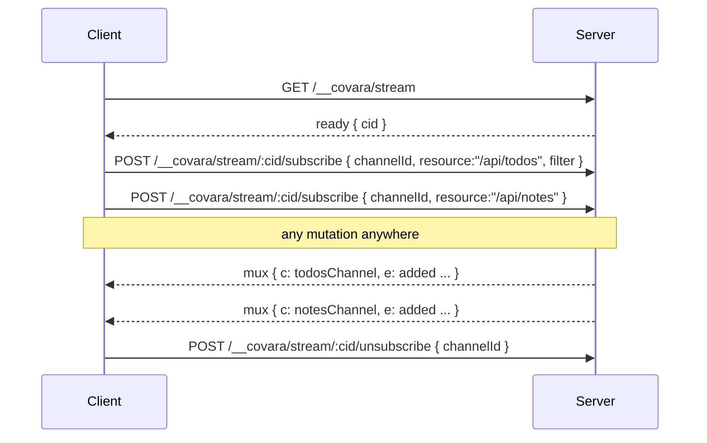

# Connection multiplexing

A page with many live hooks (`useLiveList`, `useLiveAggregate`) would normally open one SSE connection **per subscription**. Browsers cap concurrent HTTP/1.1 connections per host at ~6, so a dashboard with a dozen live regions stalls. Covara solves this by multiplexing: **all live subscriptions on a client share a single SSE stream**, and the server fans every subscription's events down that one connection.

It is **on by default and invisible** — you don't change any subscription code, client or server. `useLiveList("/api/todos")` and `repository.subscribe(...)` work exactly as before; under the hood they become channels of one shared stream.

## How it works



- The client opens **one** stream at `GET /__covara/stream`; the server replies with a `ready` event carrying a connection id (`cid`).
- Each subscription becomes a **channel**: the client sends a `POST /__covara/stream/:cid/subscribe` control message (resource path, filter, include, resumeFrom, aggregate params, …). The server starts a normal subscription bound to the shared stream.
- Events are framed with their channel id (`event: mux`, `data: { c, n, e }`) and demultiplexed on the client back into the exact `connected` / `message` / `aggregate` / `error` events each subscription expects.
- Closing a subscription sends an `unsubscribe`; closing the stream tears down every channel.

Each channel keeps its **own** auth scope, filter, `resumeFrom`/catchup, and per-user/IP subscription limits — multiplexing changes only the transport, not the semantics. A subscription can never see rows another channel is scoped to.

## Configuration

On by default. Disable or tune it per side:

```typescript
// Server — disable the endpoint, or tune the shared stream.
createCovara({
  multiplex: false, // or: { maxChannelsPerConnection: 200, heartbeatMs: 20000, maxQueueBytes: 262144 }
});

// Client — opt out of sharing (each subscription uses its own connection).
getOrCreateClient({ baseUrl: location.origin, multiplex: false });
```

## Fallback

Multiplexing degrades gracefully. If the shared stream can't be used, **each subscription transparently falls back to its own `GET /subscribe` connection** — identical to the pre-multiplex behavior. Fallback happens when:

- the server doesn't expose the endpoint (older server, or `multiplex: false`) — detected when `GET /__covara/stream` returns 404;
- the runtime has no `fetch`/`EventSource`;
- a control `POST` can't reach the process holding the stream.

That last case is the multi-isolate caveat: true single-connection multiplexing requires the control `POST` to land on the **same process** as the stream. On Node / `startServer` (a single process) that always holds. On multi-isolate deployments (e.g. Cloudflare Workers) a control `POST` may hit a different isolate; the server answers `409 stream_not_found` and that channel falls back to a per-subscription stream — correct, just not shared. (Edge deployments typically serve over HTTP/2 to the client anyway, which multiplexes connections at the transport layer.)

## Reconnection

The shared stream owns reconnection. If it drops, every channel's manager reconnects and re-subscribes with its current `resumeFrom`, so the [changelog](./changelog.md) redelivers anything missed — the same reliable, resumable delivery as a single subscription. A slow shared consumer triggers the standard backpressure policy, which resets the stream; the client reconnects and every channel catches up.

The shared connection is defensive against stuck streams so it never leaves the UI silently stale:

- **Connect timeout** — if the stream doesn't become ready within ~10s it's aborted and retried; after a few failures the affected subscriptions transparently fall back to their own per-subscription connections.
- **Stall watchdog** — every event and heartbeat resets a liveness timer; if the stream goes silent past the heartbeat window (~50s) it's treated as dead and reconnected, catching half-open connections a plain read would never notice.
- **Indefinite retry** — subscriptions reconnect with capped exponential backoff and jitter and keep trying (rather than giving up after a fixed count), so they recover on their own once the server or network comes back.

## Related

- [Subscriptions](./subscriptions.md) · [Aggregate subscriptions](./aggregate-subscriptions.md) · [Changelog](./changelog.md)
- Invariants: [contracts/subscriptions](../contracts/subscriptions.md)
