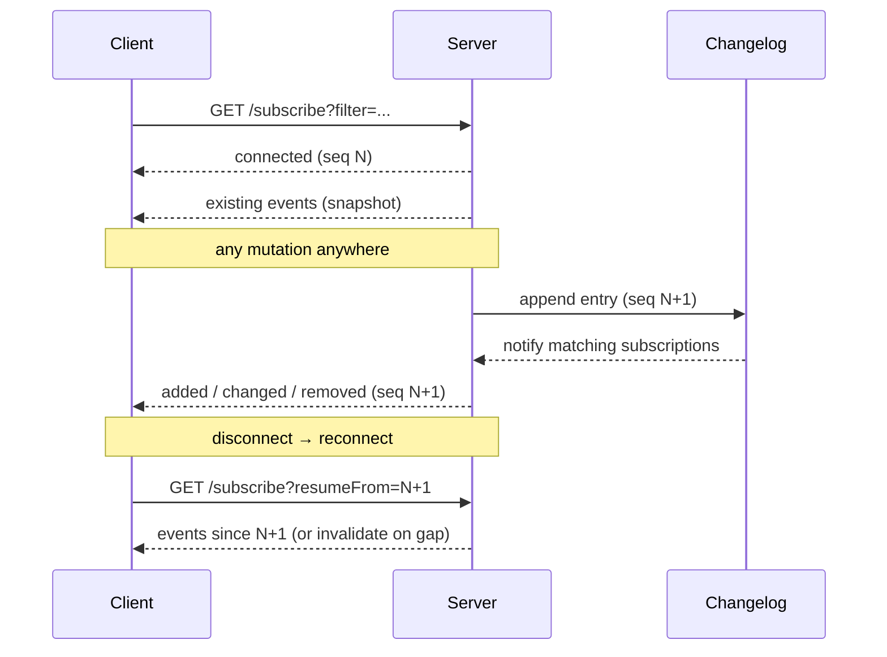

# Subscriptions

Covara delivers real-time updates over **Server-Sent Events (SSE)**, backed by a [changelog](./changelog.md) so delivery is reliable and resumable. Every resource exposes `GET /subscribe`.

:::tip One shared connection
By default every live subscription on a client shares a **single** SSE stream ([connection multiplexing](./multiplexing.md)) so a page with many live hooks doesn't exhaust the browser's per-host connection cap. It's invisible — the code below is unchanged whether multiplexing is on or off.
:::



## React (recommended)

```tsx
import { useLiveList } from "covara/client/react";

function UserList() {
  const { items, status, statusLabel, mutate } = useLiveList<User>(
    "/api/users",
    { filter: 'status=="active"' }
  );
  // status: "loading" | "live" | "reconnecting" | "offline" | "error"
  return (
    <>
      <div>Status: {statusLabel}</div>
      <ul>{items.map((u) => <li key={u.id}>{u.name}</li>)}</ul>
    </>
  );
}
```

See [Live queries](../client/live-queries.md) and [React hooks](../client/react-hooks.md).

## Low-level client API

```typescript
const users = client.resource<User>("/api/users");

const sub = users.subscribe(
  { filter: 'status=="active"' },
  {
    onAdded: (user, meta) => {}, // meta.optimisticId set if from an optimistic create
    onChanged: (user) => {},
    onRemoved: (id) => {},
    onConnected: (seq) => {},
    onDisconnected: () => {},
    onInvalidate: () => {},
    onError: (err) => {},
  }
);

sub.reconnect();
sub.resumeFrom(lastSeq);
sub.unsubscribe();
```

## Event types

| Type | Payload | Meaning |
|------|---------|---------|
| `existing` | `{ seq, object }` | One per existing item on connect (snapshot). |
| `added` | `{ seq, object }` | A new item entered the filter. |
| `changed` | `{ seq, object }` | An item was updated (still in filter). |
| `removed` | `{ seq, objectId }` | An item was deleted or left the filter. |
| `invalidate` | `{ seq, reason }` | Refetch — sequence gap, auth change, or backpressure. |

When an update moves an item across the filter boundary: enters → `added`, stays → `changed`, leaves → `removed`.

## Hybrid fetch + subscribe

Sending every existing item on connect is wasteful for large sets. The hybrid model fetches the initial page via `GET`, then subscribes with `skipExisting=true` so only deltas stream. `useLiveList` does this automatically.

Manual:

```typescript
const { items } = await users.list({ limit: 20, orderBy: "name" });
const sub = users.subscribe(
  { skipExisting: true, knownIds: items.map((i) => i.id) },
  { onAdded: () => {}, onChanged: () => {}, onRemoved: () => {} }
);
```

| Parameter | Type | Description |
|-----------|------|-------------|
| `skipExisting` | boolean | Don't send `existing` events on connect. |
| `knownIds` | comma-separated | IDs the client already has, registered for change tracking. |

With `skipExisting` and no `knownIds`, the server queries matching IDs itself to register them.

## Subscription modes (paginated views)

With a `limit`, you must decide how new items from **other** clients interact with the visible page. `subscriptionMode` controls it:

| Mode | New items | Updated items | Removed | Use case |
|------|-----------|---------------|---------|----------|
| `strict` | only your own creates | cached only | cached | Tables, admin dashboards |
| `sorted` | shown in sort order | cached only | cached | Collaborative lists, kanban |
| `append` | shown at end | cached only | cached | Chat, activity logs |
| `prepend` | shown at start | cached only | cached | Notifications, feeds |
| `live` | all | all | all known | Real-time dashboards |

**Default:** `strict` when `limit` is set, `live` otherwise.

`subscriptionMode` controls how a paginated list **renders** server-pushed changes; the subscription itself is scoped by your `filter` + auth scope (not by the loaded page window), so each client receives in-scope events and the chosen mode decides what to show.

```tsx
useLiveList<Task>("/api/tasks", { limit: 20, subscriptionMode: "sorted", orderBy: "priority:desc" });
useLiveList<Message>("/api/messages", { limit: 50, subscriptionMode: "append", orderBy: "createdAt:asc" });
```

## Relations in events

Pass `include` to receive related data on `added`/`changed`:

```bash
GET /api/todos/subscribe?include=category,tags
```

```tsx
const { items } = useLiveList<TodoWithRelations>("/api/todos", { include: "category,tags", orderBy: "position" });
```

When you optimistically change a foreign key, the stale relation is cleared immediately and refilled when the server confirms. For instant UI, look the relation up from locally cached data (`todo.category ?? categories.find(c => c.id === todo.categoryId)`).

## Mutations from custom routes

Mutations through generated endpoints record to the changelog automatically. For custom Hono routes, wrap the db with [`trackMutations`](./mutation-tracking.md):

```typescript
const db = trackMutations(baseDb, { todos: { table: todosTable, id: todosTable.id } });

app.post("/api/custom-action", async (c) => {
  const [todo] = await db.insert(todosTable).values({ title: "x" }).returning();
  return c.json(todo); // subscribers notified
});
```

## Reconnection

The subscription manager reconnects with exponential backoff + jitter, heartbeats to detect dead connections, and cleans up on page unload. On reconnect it resumes from the last sequence; if too many changes occurred (a gap), the server sends `invalidate` and the client refetches.

```typescript
users.subscribe({ resumeFrom: lastSeq });
```

## Backpressure

Each connection has a bounded outbound queue. When a slow consumer fills it, the resource's policy applies instead of unbounded buffering:

```typescript
useResource(todos, {
  db,
  id: todos.id,
  sse: {
    maxQueueBytes: 65536,         // high-water mark (default 64 KB)
    onBackpressure: "invalidate", // "invalidate" (default) | "disconnect" | "drop"
    heartbeatMs: 30000,
    scopeRecheckMs: 30000,        // re-resolve each sub's auth scope this often (default 30s; 0 disables)
    maxSubscriptionsPerUser: 50,
    maxSubscriptionsPerIP: 100,
    maxTotalSubscriptions: 10000,
  },
});
```

- `invalidate` — send one `invalidate` so the client refetches from a consistent state.
- `disconnect` — close; the client reconnects and resumes from its last sequence.
- `drop` — skip the event for this connection (it may miss updates until the next sync).

## Auth

Subscriptions respect [auth scopes](../auth/scopes.md) (`auth.subscribe`). If a user's auth expires, the server sends `invalidate` with reason `"Authentication expired"`.

A subscription's scope is otherwise resolved once at connect. To catch **out-of-band** permission changes (e.g. losing org membership without any row mutation), each subscription periodically re-resolves its scope every `sse.scopeRecheckMs` (default 30s, `0` disables) and emits `removed`/`added` for rows that left/entered scope. This reflects changes the scope resolver recomputes on each call (e.g. resolvers that query current membership/roles); a resolver reading only static fields off the connect-time user still requires a reconnect. See the [subscriptions contract](../contracts/subscriptions.md#scope-changes).

## Cross-instance fan-out

Subscriptions work across instances when every instance shares a distributed [KV](../platform/kv.md) (Redis or Durable Object KV) initialized with `initializeKV`, which auto-wires cross-process event fan-out. See [Scaling across instances](../deployment/workers.md#scaling-across-instances).

## Related

- [Changelog](./changelog.md) · [Mutation tracking](./mutation-tracking.md) · [Aggregate subscriptions](./aggregate-subscriptions.md)
- [Live queries](../client/live-queries.md) · [Subscriptions contract](../contracts/subscriptions.md)
