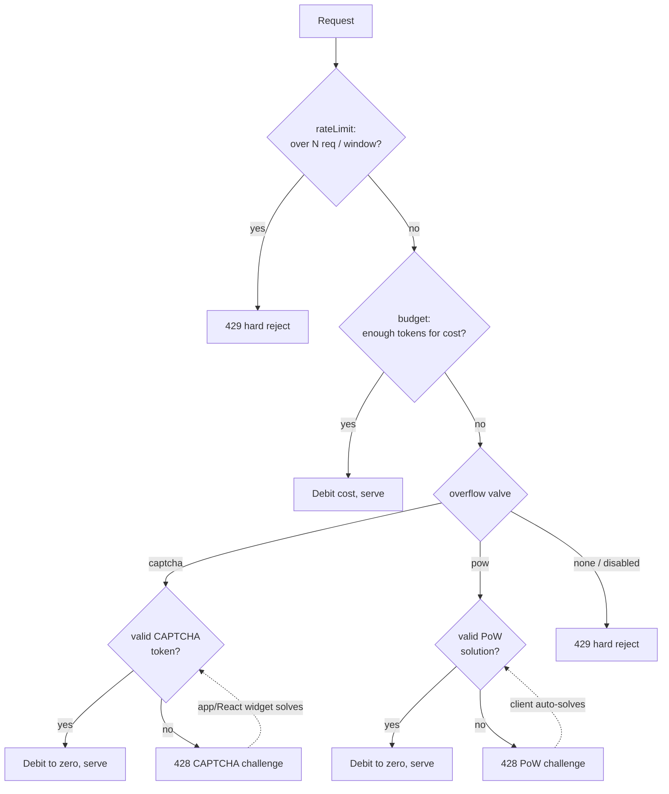

# Abuse protection

Covara's abuse protection is a cost-weighted **budget** with **proof of work
(PoW)** as the overflow valve, configured globally with
`abuseProtection({ budget, pow })`. It works on Node and Cloudflare Workers and
is KV-backed with an in-memory fallback.

- **Budget** — a token bucket keyed by identity class (anonymous → IP,
  authenticated → user). Each operation declares an inline **cost**. While the
  bucket has tokens, the request is served and the cost is debited.
- **Proof of work (overflow valve)** — when the bucket is exhausted, instead of
  a hard rejection the server answers with **428** plus a signed challenge in
  response headers. The client library solves it and retries **transparently**
  (callers never see it — the request just takes a little longer), and solving
  **pays the overdraft**: the bucket is debited to a floor of zero. The
  difficulty is scalable via a trust hook (return `0` to wave a caller through).
- **Always-on PoW** — an endpoint can also require PoW on *every* request,
  independent of budget, via its `pow` opt-in (see below).
- **CAPTCHA (beta)** — a human-verification challenge that can gate specific
  endpoints (signup/login/…) and/or act as the budget-overflow valve instead of
  PoW. See [CAPTCHA](#captcha-beta) below.

If PoW is turned off (`pow.enabled: false`) and CAPTCHA isn't the overflow valve,
budget exhaustion falls back to a hard **429** — the classic rate-limit behavior.

## Configuration

```ts
import { abuseProtection, createCovara, getUser } from "covara";

const protection = abuseProtection({
  budget: {
    enabled: true,
    // classify is optional; this is the default
    classify: (c) => (getUser(c) ? "authenticated" : "anonymous"),
    classes: {
      anonymous: { capacity: 100, refillPerMinute: 20 },
      authenticated: { capacity: 500, refillPerMinute: 100 },
    },
  },
  pow: {
    enabled: true,
    secret: process.env.COVARA_POW_SECRET, // see "Secret" below
    difficulty: 18,
    // trust hook: return 0 to skip the challenge for trusted callers, or scale
    // by how far over budget the request is. `reason` is "endpoint" (always-on
    // gate) or "budget" (overflow); for "budget" you also get cost/available/deficit.
    getDifficulty: ({ user, reason, deficit = 0, baseDifficulty }) =>
      user ? 0 : baseDifficulty + Math.min(6, Math.floor(deficit / 50)),
    challengeTtlMs: 120_000,
  },
});

const app = createCovara({ abuseProtection: protection });
```

> Costs and PoW opt-ins live **on the individual endpoints**, not in a central
> map — `abuseProtection` only holds the budgets and the shared PoW settings.

### Per-endpoint costs and gates

Resources declare per-operation costs and an optional PoW gate:

```ts
app.resource("/api/todos", todos, {
  db,
  id: todos.id,
  // Charged against the budget; over-budget requests trigger the PoW overflow.
  cost: { read: 1, create: 5, update: 5, delete: 5 },
  // Optional: ALWAYS require PoW for these operations, regardless of budget.
  // `true` gates create/update/delete at the default difficulty; an object can
  // override difficulty / trust hook / the gated operations.
  pow: { difficulty: 20, operations: ["create"] },
  procedures: {
    generate: defineProcedure({
      input,
      output,
      cost: 200, // expensive RPC — likely to overflow the budget
      pow: true, // ...and always require PoW on top
      handler,
    }),
  },
});
```

### Making an action *always* require PoW

PoW normally only kicks in on budget overflow. To require it on every request to
an action, either:

- set `pow` on the endpoint (`pow: true` or `pow: { difficulty }`) — an
  always-on gate, independent of (and stacked with) the budget; or
- give the action a `cost` that always exceeds the class capacity, so every
  request overflows and is challenged.

The endpoint `pow` opt-in is the explicit, recommended way.

Auth routes declare their own costs and gates:

```ts
useAuth({
  session,
  login: {
    validateCredentials,
    cost: { failed: 20 }, // pre-charged, refunded on success
    pow: true,
  },
  signup: { createUser, cost: 50, pow: { difficulty: 22 } },
  passwordReset: { /* ... */ cost: 40, pow: true },
});
```

The failed-login budget is **gated before credentials are checked** (a
budget-exhausted client must solve PoW — or is 429'd when PoW is off — before it
can even attempt), and the `failed` cost is **only committed on an actual failed
attempt**. Successful logins are never charged, so the cost throttles brute
force without penalizing legitimate users.

## The proof-of-work protocol

| Direction | Status | Headers |
| --- | --- | --- |
| Server → client (challenge) | `428` | `Covara-PoW-Challenge`, `Covara-PoW-Difficulty`, `Covara-PoW-Algorithm` |
| Client → server (solution) | — | `Covara-PoW-Challenge` (echoed), `Covara-PoW-Nonce` |

- The **challenge token** is `base64url(payload).base64url(HMAC_SHA256(secret, payload))`
  where the payload carries the difficulty, an expiry, a random nonce, and a
  fingerprint of the request.
- The **fingerprint** binds the challenge to the exact request
  (`method + path + body hash`), so a solution can't be reused for a different
  request.
- The client finds a `nonce` such that
  `sha256(token + ":" + nonce)` has at least `difficulty` leading zero bits.
- Verification is **stateless** (HMAC + expiry + fingerprint + difficulty);
  one-time-use is enforced by a short-TTL replay cache (KV, or in-memory when no
  KV is configured).

### Client transparency

The client library solves challenges automatically — no code change required:

```ts
const client = getOrCreateClient({ baseUrl, credentials: "include" });
await client.repository("/api/todos").create({ title: "hi" });
// If the server demanded PoW, the client solved it and retried; the caller
// only notices the call took longer.
```

Disable or tune it via `pow`:

```ts
getOrCreateClient({ baseUrl, pow: { enabled: false } });        // opt out
getOrCreateClient({ baseUrl, pow: { maxAttempts: 5 } });        // default 3
```

## Secret

PoW verification needs a stable HMAC secret. Resolution order:

1. `abuseProtection.pow.secret`
2. the `COVARA_POW_SECRET` environment variable
3. a random per-process secret (development only — logged as a warning)

A random per-process secret **breaks verification across processes/restarts**,
so any multi-process or serverless deployment must set `COVARA_POW_SECRET`
explicitly.

## CAPTCHA (beta)

:::caution Beta
CAPTCHA support is **beta**. The API (provider factories, headers, the React
component) may change in a future minor release.
:::

CAPTCHA is a human-verification challenge. Unlike PoW, the client library
**cannot silently solve it** — a human (or an invisible provider widget) is
required — so the app must be involved. Use it to gate sensitive endpoints
(signup/login/password-reset) and/or as the budget-overflow valve instead of PoW.

### Server config

```ts
import { abuseProtection, turnstile } from "covara";

abuseProtection({
  budget: { enabled: true, classes: { anonymous: { capacity: 100, refillPerMinute: 20 } } },
  captcha: {
    provider: turnstile({ secret: process.env.TURNSTILE_SECRET!, siteKey: "0x4AAA…" }),
    // tokenHeader defaults to "Covara-Captcha-Token"
  },
  // Make the budget overflow demand a CAPTCHA instead of PoW (globally):
  overflow: "captcha",
});
```

Built-in providers (all fetch-based, Workers-safe, fail-closed):
`turnstile({ secret, siteKey })`, `hcaptcha({ secret, siteKey })`,
`recaptcha({ secret, siteKey, minScore? })` (v3 score + action), and
`customCaptcha({ verify })` for anything else.

Per-endpoint gates (always-on or risk-based), mirroring `pow`:

```ts
app.resource("/api/comments", comments, {
  db, id: comments.id,
  // Always require a CAPTCHA to create; gate other ops on overflow only.
  captcha: { operations: ["create"], action: "comment" },
  // Optionally route this resource's overflow to CAPTCHA:
  overflow: "captcha",
});

useAuth({
  session,
  signup: { createUser, captcha: true },               // always
  login:  { validateCredentials, captcha: { required: ({ ip }) => isSuspicious(ip) } }, // risk-based
  passwordReset: { /* ... */ captcha: true },
});
```

When both a CAPTCHA gate and a PoW gate apply to the same request, **CAPTCHA
takes precedence**. If `overflow: "captcha"` but no CAPTCHA provider is
configured, the overflow falls back to PoW (then to a hard 429).

### Protocol

| Direction | Status | Headers |
| --- | --- | --- |
| Server → client | `428` | `Covara-Challenge-Type: captcha`, `Covara-Captcha-Provider`, `Covara-Captcha-Sitekey`, optional `Covara-Captcha-Action` |
| Client → server | — | `Covara-Captcha-Token` |

`Covara-Challenge-Type` (`pow` \| `captcha`) lets the client tell the two 428
challenge kinds apart. Provider tokens are single-use server-side.

### Client (plain TS)

Register a `solve` callback; the transport calls it on a CAPTCHA 428 and retries
with the token. Without a solver, the 428 surfaces as a `TransportError` whose
`isCaptchaRequired()` is `true` (with `.captchaProvider` / `.captchaSiteKey`),
which the app can catch and handle itself.

```ts
getOrCreateClient({
  baseUrl,
  captcha: {
    solve: async ({ provider, siteKey, action }) => renderWidgetAndGetToken(provider, siteKey, action),
  },
});
```

### Client (React)

Mount `<CovaraCaptcha/>` once near your app root. It registers a solver and, when
a challenge arrives, **renders the provider widget** in a modal (or runs silently
for invisible providers), resolving the token so the request retries
transparently:

```tsx
import { CovaraCaptcha } from "covara/client/react";

function App() {
  return (
    <>
      <YourRoutes />
      <CovaraCaptcha />        {/* loads the provider widget on demand */}
    </>
  );
}
```

Use the `useCaptcha()` hook (and `captchaController.resolveCurrent(token)`) to
build a fully custom CAPTCHA UI instead of the default modal.

> SSE subscriptions can't carry the token header, so CAPTCHA (like PoW) is not
> applied in-band to `GET /subscribe`.

## Relationship to the conventional rate limiter

The existing per-resource [`rateLimit`](./middleware.md) (fixed-window request
count) still works and is unchanged. Both stack and run in this order per
resource: **`rateLimit` → abuse protection (budget + PoW overflow)**.

- `config.rateLimit` — simple "N requests per window per resource", every
  operation counted equally, always a hard `429`. Kept for backward
  compatibility.
- `abuseProtection` — **preferred**: cost-weighted, one shared bucket per
  identity class across resources, with PoW as the overflow valve (or a hard
  429 when `pow.enabled: false`).

A conventional `rateLimit` rejection and a budget hard-429 both raise
`RateLimitError` (429 + `Retry-After`); the client **never auto-retries** a 429 —
only a 428 PoW challenge is solved automatically. `rateLimit` and `budget` are
usually redundant; pick one per resource (enabling both is supported —
`rateLimit` acts as a hard request-count ceiling above the weighted budget).

## Using all three together

The three mechanisms compose. A request runs them in order —
**`rateLimit` → budget → PoW overflow** — and each can stop it:



(Always-on endpoint gates — `pow: true` / `captcha: true` — issue a challenge
even on the "enough tokens" path; CAPTCHA takes precedence over PoW when both
apply to the same request.)

A complete server wiring that uses every layer:

```ts
import { createCovara, abuseProtection, defineProcedure, getUser } from "covara";
import { z } from "zod";

const app = createCovara({
  abuseProtection: abuseProtection({
    budget: {
      enabled: true,
      classes: {
        anonymous: { capacity: 100, refillPerMinute: 20 },
        authenticated: { capacity: 1000, refillPerMinute: 200 },
      },
    },
    pow: {
      enabled: true,
      secret: process.env.COVARA_POW_SECRET,
      difficulty: 18,
      // Wave authenticated users through; make anonymous overflow scale with
      // how far over budget the request is.
      getDifficulty: ({ user, deficit = 0, baseDifficulty }) =>
        user ? 0 : baseDifficulty + Math.min(6, Math.floor(deficit / 50)),
    },
  }),
});

app.resource("/api/todos", todos, {
  db,
  id: todos.id,

  // Layer 1 — a coarse hard ceiling: at most 300 requests/min per caller,
  // counted equally, regardless of operation. Always a 429.
  rateLimit: { windowMs: 60_000, maxRequests: 300 },

  // Layer 2 — cost-weighted budget: reads are cheap, writes are pricier. When
  // the bucket runs dry these overflow into a PoW challenge (Layer 3).
  cost: { read: 1, create: 5, update: 5, delete: 5 },

  // Layer 3 (targeted) — `delete` ALWAYS requires PoW, even with budget to
  // spare, because it's destructive. Other operations only get PoW on overflow.
  pow: { operations: ["delete"], difficulty: 22 },

  procedures: {
    // An expensive RPC: high cost (overflows quickly) AND always-on PoW.
    generate: defineProcedure({
      input: z.object({ prompt: z.string() }),
      output: z.object({ text: z.string() }),
      cost: 200,
      pow: true,
      handler: async (ctx, input) => ({ text: await runModel(input.prompt) }),
    }),
  },
});
```

And on the auth routes:

```ts
useAuth({
  session,
  // Brute-force protection: each failed attempt costs budget; once drained the
  // attacker must solve PoW to keep trying. Successful logins are never charged.
  login: { validateCredentials, cost: { failed: 25 } },
  // Account-spam protection: every signup costs budget; over budget -> PoW.
  signup: { createUser, cost: 50 },
  // Always require PoW for password-reset requests (cheap to abuse, no budget
  // needed) and also charge them.
  passwordReset: { /* ... */ cost: 40, pow: true },
});
```

Client side, **nothing changes** — the transport solves any 428 challenge
(rate-limit and budget 429s surface as normal errors):

```ts
const client = getOrCreateClient({ baseUrl, credentials: "include" });
await client.repository("/api/todos").create({ title: "hi" }); // may transparently solve PoW
```

How to think about picking layers:

- Use **`rateLimit`** for a blunt, predictable ceiling you never want exceeded
  (e.g. an absolute requests-per-minute cap), accepting that legitimate bursts
  are rejected.
- Use **`budget`** as the everyday cost-aware limiter — cheap reads, expensive
  writes/RPCs — so normal usage is smooth and only abuse hits the wall.
- Use **`pow`** (overflow) so that wall is *elastic*: instead of failing,
  over-budget callers pay with CPU and keep working — while bots pay dearly.
- Add **always-on `pow`** to individual destructive or expensive operations that
  warrant a cost on every call.

## Limitations

SSE subscriptions (`GET /subscribe`, `/aggregate/subscribe`) use the browser
`EventSource`, which cannot send custom headers or transparently re-handshake a
428 — **PoW is not applied in-band to SSE**. Budget can still gate `subscribe`
at handshake time (a 429 before the stream opens).
